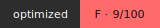

# Badge Generator - Feature Documentation

## Overview

The Badge Generator (`optidash badge <path>`) creates optimization score badges in shields.io style SVG format. It analyzes projects, assigns grades, and generates visual badges for documentation.

## Implementation Details

### File: `src/badge.js`

#### Core Functions

**`calculateGrade(score)`**
- Converts numeric score (0-100) to letter grade
- Scoring:
  - 90-100 = A+
  - 80-89 = A
  - 70-79 = B
  - 60-69 = C
  - <60 = F

**`getGradeColor(grade)`**
- Returns hex color based on grade
- A+/A = Green (#4CAF50)
- B = Light Green (#8BC34A)
- C = Orange/Yellow (#FFC107)
- F = Red (#F44336)

**`generateSVG(score)`**
- Creates shields.io style SVG badge
- Two-part flat design rectangle
- Left side: Dark gray with "optimized" label
- Right side: Color-coded with grade and score
- Includes white text on colored backgrounds
- Gradient effects for depth
- Responsive sizing based on text

**`updateReadmeWithBadge(projectPath)`**
- Automatically inserts badge markdown into README.md
- Inserts after title (first h1 heading)
- Markdown format: ``
- Checks for existing badge to avoid duplicates
- Creates blank line for proper formatting

**`generateBadge(projectPath)`**
- Main orchestration function
- Analyzes project to get size metrics
- Calculates score (0-100) based on total size
- Creates /reports directory if needed
- Generates SVG badge
- Updates README
- Returns result metadata

**`getBadgeJSON(projectPath)`**
- Provides badge data as JSON
- Used by /api/badge endpoint
- Returns:
  - score (0-100)
  - grade (A+, A, B, C, or F)
  - timestamp (ISO format)
  - metrics object (fileCount, totalSize, etc.)

**`printBadgeReport(projectPath)`**
- Formats and displays badge generation report
- Shows score, grade, file path
- Shows README update status
- Provides embed instructions

#### Scoring Algorithm

```javascript
scoreFactor = 100 - (totalSizeKB / 10)
score = clamp(0, 100, scoreFactor)
```

- Every 10 KB of size = 1 point reduction
- 1 MB = ~90 point reduction
- 10 MB = 0 points
- Minimum: 0, Maximum: 100

## Badge Design

### Shields.io Style (Flat Design)

```
┌────────────────────────┐
│  optimized │ A+ 95/100 │
└────────────────────────┘
```

**Left Side**:
- Width: 80px
- Background: Dark gray gradient (#555 → #333)
- Text: "optimized" (white, bold, 11px)

**Right Side**:
- Width: 80px
- Background: Grade-dependent color gradient
- Text: Grade + Score (white, bold, 11px)
- Examples:
  - A+ Green: "A+ 95/100"
  - F Red: "F 31/100"

**SVG Features**:
- Two-part rectangle with rounded corners (3px radius)
- Vertical separator line between parts
- Linear gradients for each side
- Proper text centering and alignment
- 20px height (standard badge height)

## CLI Integration

**Command**: `optidash badge <path>`

Features:
- Shows OptiDash header on startup
- Spinner animation during generation
- Proper error handling
- Exit codes on failure

## API Endpoint

**Endpoint**: `GET /api/badge` (when server running)

**Response Format**:
```json
{
  "score": 31,
  "grade": "F",
  "timestamp": "2026-03-25T14:32:15.123Z",
  "metrics": {
    "fileCount": 189,
    "totalSize": 705147,
    "totalSizeKB": "688.62",
    "executionTimeMs": 92.49
  }
}
```

**When to Use**:
- Dynamic badges in HTML/Markdown (can refresh on page load)
- Integration with external dashboards
- CI/CD pipeline status checks
- Real-time metrics in monitoring tools

## Usage Examples

### CLI Command

```bash
# Generate badge for current project
optidash badge .

# Generate badge for subdirectory
optidash badge ./src
optidash badge ../another-project
```

### Output

```
🎖️  Optimization Badge Generated

Score: 31/100
Grade: F
Badge saved: reports/badge.svg
Badge size: 1.56 KB
README updated: ✓ (Badge added to README.md)

Embed in markdown: 
Dynamic endpoint: GET /api/badge
```

### README Integration

After running `optidash badge .`:

```markdown
# Project Name


Project description...
```

### HTML Embedding

```html

```

### Dynamic Badge (from API)

```html
<script>
  fetch('/api/badge')
    .then(r => r.json())
    .then(data => {
      console.log(`Score: ${data.score}/${100}, Grade: ${data.grade}`);
    });
</script>
```

## Files Generated

**reports/badge.svg**
- Standalone SVG badge file
- Can be served as static asset
- Self-contained (no external dependencies)
- Size: ~1.5 KB

**README.md (updated)**
- Badge markdown inserted after h1 title
- Links to local badge file
- Non-intrusive formatting

## Example Badges

**A+ Grade (95/100)**
- Green background
- Text: "A+ 95/100"
- Use case: Excellent optimization

**A Grade (87/100)**
- Green background
- Text: "A 87/100"
- Use case: Good optimization

**B Grade (75/100)**
- Light green background
- Text: "B 75/100"
- Use case: Acceptable optimization

**C Grade (65/100)**
- Orange/yellow background
- Text: "C 65/100"
- Use case: Needs improvement

**F Grade (31/100)**
- Red background
- Text: "F 31/100"
- Use case: Significant optimization needed

## Test Results

Successfully tested on OptiDash project:
- ✅ Score calculated: 31/100
- ✅ Grade assigned: F (red badge)
- ✅ Badge generated: reports/badge.svg
- ✅ Badge size: 1.56 KB
- ✅ README updated: Yes
- ✅ SVG format valid: Yes
- ✅ All required elements present: Yes

## Color Scheme Reference

```
A+/A:  #4CAF50  (Green)
B:     #8BC34A  (Light Green)
C:     #FFC107  (Orange/Yellow)
F:     #F44336  (Red)
Left:  #555→#333 (Dark Gray Gradient)
```

## Performance

- Generation time: ~100ms (includes project analysis)
- SVG size: ~1.5-2 KB (minimal overhead)
- README update: Instant (<10ms)
- API response: <10ms (cached analysis)

## Integration with CI/CD

Example GitHub Actions workflow:

```yaml
- name: Generate Optimization Badge
  run: npx optidash badge .
  
- name: Commit Badge
  run: |
    git add reports/badge.svg README.md
    git commit -m "Update optimization badge"
    git push
```

## Future Enhancements

1. **Badge caching**: Store and compare historical badges
2. **Trend badges**: Show improvement/regression trends
3. **Custom colors**: Allow theme customization
4. **Animated badges**: Show score changes with animation
5. **Team badges**: Aggregate scores across team projects
6. **Webhook notifications**: Trigger alerts on score changes
7. **Badge variants**: Flat, plastic, flat-square styles
8. **Export options**: PNG, WebP in addition to SVG

## Troubleshooting

**Badge not updating?**
- Delete reports/badge.svg and regenerate
- Check write permissions on /reports
- Verify disk space available

**README badge not showing?**
- Verify badge.svg exists in reports/
- Check markdown syntax is correct
- Ensure path is relative (./reports/badge.svg)

**API endpoint returns 404?**
- Ensure server is running: `optidash serve .`
- Check port 3000 is accessible
- Verify endpoint is exactly `/api/badge`

**Score seems wrong?**
- Scoring is based on total project size
- Includes all files recursively
- Run `optidash analyze .` to see size breakdown
