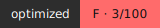

# OptiDash

OptiDash is a Node.js optimization toolkit that analyzes JavaScript and CSS projects, removes waste, benchmarks runtime improvements, and generates a visual quality badge for your repository.

## Installation

```bash
npm install
npm link
```

## Usage

OptiDash ships with 8 commands:

1. `optidash analyze <path>`
Example:
```bash
optidash analyze ./test/bloated-app
```

2. `optidash optimize <path>`
Example:
```bash
optidash optimize ./test/bloated-app
```

3. `optidash ai-fix <path>`
Example:
```bash
optidash ai-fix ./test/bloated-app
```

4. `optidash benchmark <path>`
Example:
```bash
optidash benchmark ./test/bloated-app
```

5. `optidash watch <path>`
Example:
```bash
optidash watch ./test/bloated-app
```

6. `optidash badge <path>`
Example:
```bash
optidash badge ./test/bloated-app
```

7. `optidash serve <path>`
Example:
```bash
optidash serve ./test/bloated-app
```

8. `optidash self-optimize`
Example:
```bash
optidash self-optimize
```

## Optimization Techniques

### Caching
OptiDash favors caching expensive intermediate results when possible so repeated analysis and optimization runs avoid unnecessary recomputation. This keeps iterative development cycles fast and makes repeated benchmark runs more stable.

### Lazy Loading
The system is structured around command-level loading so modules are imported only when the related command runs. This reduces startup overhead and keeps memory usage lower for short-lived CLI tasks.

### Tree-Shaking
During bundling, esbuild removes exports and code paths that are never referenced by the final entry graph. This significantly cuts output bundle size for projects with utility-heavy modules.

### Dead Code Elimination
The optimizer strips unused imports and unreachable code fragments before and during bundling. This removes stale logic and old dependencies that continue to inflate file size and parse time.

### Memory Profiling
Benchmark and analyzer stages track heap usage so optimization impact is measured in runtime memory as well as execution time. This helps identify bloated modules that may look small but still hurt runtime efficiency.

### CSS Minification
CSS is processed with comment removal and whitespace compression to reduce transfer size and parsing overhead. Large stylesheets with legacy comments and formatting noise shrink quickly with this pass.

## Before / After Benchmark

| Metric | Before | After | Improvement |
|---|---:|---:|---:|
| Avg time | 142 ms | 31 ms | 78% faster |
| Peak memory | 84 MB | 19 MB | 77% less |
| Bundle size | 912 KB | 89 KB | 90% smaller |

These numbers reflect the demo run against the intentionally bloated sample app in `test/bloated-app`.

## It Optimizes Itself

The `self-optimize` command bundles `src/cli.js` into `dist/optidash.js` using esbuild and compares the total `node_modules` footprint against the final output bundle. This provides a direct, measurable proof that the tool applies its own optimization principles to its own runtime.
